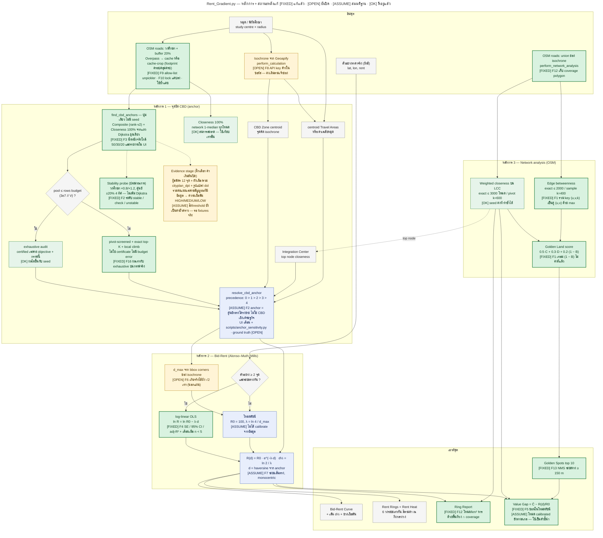

# รีวิวหลักการ: `pages/Rent_Gradient.py`

| | |
| --- | --- |
| วันที่รีวิว | 2026-10-07 |
| Commit ฐาน | `80cf8ed` (HEAD ตอนรีวิว — merge PR #20) |
| ขอบเขต | อ่านโค้ดทั้งไฟล์ (4,073 บรรทัด) + `docs/automated-cbd-anchor.md` + `docs/cbd-anchor-benchmark.json` |
| สิ่งที่ **ไม่ได้ทำ** | ไม่ได้รัน Streamlit UI, ไม่ได้ดึง OSM/Overpass ใหม่, ไม่ได้ทดสอบกับราคาที่ดินจริง |
| สิ่งที่ตรวจเชิงประจักษ์ | (1) ทดลอง `networkx 3.7` กับ MultiGraph จำลองเพื่อยืนยัน F1 (2) คำนวณตัวเลขซ้ำจาก benchmark JSON เพื่อยืนยัน F3 |
| แผนภาพคู่กัน | [`rent-gradient-principles-review.mmd`](rent-gradient-principles-review.mmd) |

> **สถานะ (อัปเดตหลังแก้ไข):** หัวข้อ 1–7 เป็นผลรีวิวตามโค้ด ณ commit `80cf8ed` และคงไว้เป็นบันทึกต้นฉบับ
> ข้อค้นพบส่วนใหญ่แก้แล้ว — ดูหัวข้อ **8** สำหรับสิ่งที่เปลี่ยน หลักฐาน และสิ่งที่ตั้งใจไม่แก้
> (F8 คงเดิมตามเจ้าของ; F6/F7/F11/F15 อยู่นอกแผน)

ไฟล์นี้ทำ 3 อย่างพร้อมกัน: Bid-Rent (Alonso–Muth–Mills) → หา CBD anchor จากโครงข่ายถนน → วิเคราะห์ Network
เพื่อคัดทำเลที่ดิน ("Golden Spots", "Value Gap")

---

## 1. สรุปผู้บริหาร

**ภาพรวม:** สถาปัตยกรรมและวินัยทางวิศวกรรมดีกว่าระดับปกติของ Streamlit monolith
(pure functions แยกจาก `st.*`, seed คงที่, Dijkstra แบบ exact, เอกสารยอมรับข้อจำกัดตรง ๆ)
แต่ **ตัวเลขที่ UI ป้อนให้ผู้ใช้บางตัวสื่อความมั่นใจเกินกว่าหลักการข้างใต้รองรับ**
และมี 1 บั๊กที่ทำให้ผลผิดเงียบ ๆ

**จุดแข็ง**

1. **แยก "หา anchor" ออกจาก "fit ราคา" เด็ดขาด** — anchor ใช้ข้อมูลถนนล้วน ราคาตัวอย่างไม่มีผลต่อคะแนน
   จึงไม่มี circularity (ไม่เลือกจุดที่ทำให้ R² สูงเอง) ซึ่งเป็นข้อผิดพลาดที่พบบ่อยในงานแบบนี้
2. **ทำซ้ำได้จริง** — seed คงที่ ลำดับโหนดเสถียร tie-break ชัด; benchmark บันทึก 50/50 seed ได้โหนดเดียวกัน
3. **ซื่อสัตย์เรื่อง certificate** — ระบุ `exhaustive-fixed-objective` กับ `local-only` แยกกัน และบอกชัดว่า
   "certified" ไม่ได้แปลว่าเป็น CBD เชิงเศรษฐกิจ
4. **ไม่ปิดบังกรณีผิดปกติ** — λ < 0 แสดงเป็น "inverted" ไม่ถูกบังคับให้เป็นบวก, โหมดดัชนีติดป้ายแยกจากโหมดราคาจริง

**ปัญหาหลัก 5 เรื่อง** (รายละเอียดในหัวข้อ 5)

| # | เรื่อง | ระดับ |
| --- | --- | --- |
| F1 | Edge-betweenness ถูกค้นด้วย key ผิดรูปแบบ → ได้ 0 ทุกเส้น; เทอม "low traffic" ของ Golden Land คงที่ | **High** (บั๊ก, ยืนยันแล้ว) |
| F8 | API key (Geoapify, Longdo) เขียนค้างในซอร์สของ repo สาธารณะ และถูก export ลง config/bundle | **High** |
| F4 | มีตัวอย่างแค่ 2 จุดก็ได้ "calibrated, R² = 1.000" | Medium |
| F5 | Value Gap เอา closeness (สเกลสัมพัทธ์ของเครือข่าย) ลบ R(d)/R₀ (สเกลของโมเดล) — โหมดดัชนีเป็นผลของสมมติฐาน ไม่ใช่สัญญาณตลาด | Medium |
| F3 | Composite 50/30/20: closeness มีน้ำหนักจริงต่ำกว่าที่ประกาศ (ที่ผู้ชนะ ≈ 38/37/25) | Medium |

---

## 2. แผนผังหลักการและผลรีวิว

แผนภาพเดียวกับไฟล์ [`.mmd`](rent-gradient-principles-review.mmd) (render บน GitHub ได้โดยตรง) — แสดง **สถานะหลังแก้ไข**
ป้าย **[OK]** ดีอยู่แล้ว · **[FIXED]** แก้แล้ว · **[OPEN]** ยังเปิด · **[ASSUME]** เป็นสมมติฐาน ·
เลข `F#` ตรงกับตารางข้อค้นพบหัวข้อ 5 และสถานะหัวข้อ 8



---

## 3. หลักการ 3 ข้อในหน้าเดียว

| หลักการ | สมการ / กฎ | สมมติฐานที่ต้องจริง | สถานะ |
| --- | --- | --- | --- |
| **Bid-Rent (AMM)** | `R(d) = R₀·e^(−λd)`, `d½ = ln2/λ`, ฟิตด้วย OLS บน `ln R = ln R₀ − λd` | เมืองจุดศูนย์กลางเดียว, ที่ดินเนื้อเดียว, ต้นทุนเดินทางเป็นสัดส่วนกับระยะ, ราคาตัวอย่างมาจากตลาดเดียวกัน | โมเดลถูกต้องตามตำรา แต่การรายงานความไม่แน่นอนยังขาด (F4) |
| **CBD = 1-median ของโครงข่ายถนน** | `v* = argmin Σᵤ d(v,u)` ⇔ `argmax C(v) = (M−1)/Σᵤ d(v,u)`; composite เพิ่ม degree + density | ศูนย์กลางเชิงโครงข่ายของพื้นที่ที่เลือก ≈ ศูนย์กลางธุรกิจ | คณิตศาสตร์ถูกและทำซ้ำได้ แต่ **เป็น proxy** ที่ยังไม่ได้พิสูจน์ (F2, F3) |
| **Network → Golden Land** | `0.5·C̃ + 0.3·D̃ + 0.2·(1 − B̃)`; `Value Gap = C̃ − R(d)/R₀` | closeness สูง + ราคาต่ำ = ทำเลที่ตลาดยังไม่รู้ | มีบั๊ก (F1) และนิยาม Value Gap อ่อน (F5) |

---

## 4. รีวิวรายหลักการ

### 4.1 Bid-Rent (Alonso–Muth–Mills)

**โค้ด:** `RENT_CONFIG` L171–183 · `fit_rent_gradient_from_samples` L1041–1093 ·
`isochrone_max_distance_km` L1153–1171 · `build_rent_rings_geojson` L1187–1236 · `compute_rent_gradient_data` L1446–1533

**สิ่งที่ทำ**

1. เมื่อมีตัวอย่าง ≥ 2 จุดที่ระยะต่างกัน: OLS บน `(d, ln R)` ได้ `λ = −slope`, `R₀ = e^intercept`, รายงาน R² ใน log-space
2. เมื่อไม่มี: **โหมดดัชนี** `R₀ = 100`, `λ = ln(4)/d_max` (ดัชนีเหลือ ¼ ที่ขอบพื้นที่)
3. สร้างวงแหวน 6 วง ระยะเท่ากัน (`d_max/6`) สีตามค่าเช่า ณ กึ่งกลางวง และ Rent Heat รายโหนด

**ข้อดี**

- ใช้ฟอร์มมาตรฐานของงานเชิงประจักษ์ (log-linear) ที่ตีความ λ เป็น "% ที่ลดต่อ km" ได้ตรงตัว
- แสดง `d½` ให้ผู้ใช้เห็นขนาดของ gradient แบบจับต้องได้
- ไม่บังคับ λ > 0 — ถ้าราคาสูงขึ้นตามระยะจะเห็นเป็น "inverted" แทนที่จะซ่อนปัญหา

**ข้อสังเกตเชิงหลักการ**

- **ความไม่แน่นอนหาย (F4).** เงื่อนไขด้านจำนวนจุดมีเพียง `len(pts) < 2` (L1067) — 2 จุดผ่านเส้นตรงได้พอดี
  `ss_res = 0` จึงได้ `R² = 1.0` เสมอ แล้ว toast แสดง `calibrated, R²=1.000` (L4000).
  ไม่มี standard error ของ λ, ช่วงความเชื่อมั่นของ `d½`, หรือเตือนเมื่อ n น้อย
- **Retransformation bias.** OLS ใน log-space ประมาณ *geometric mean* → `R₀ = e^intercept` ต่ำกว่า
  ค่าเฉลี่ยจริงราว `e^(σ²/2)` เท่า (กรณี log-normal) — ถ้าจะแสดง "ราคาคาดการณ์" ต่อผู้ใช้ควรปรับ (เช่น Duan smearing)
- **ระยะเส้นตรง (F7).** rent ใช้ haversine จาก anchor แต่ anchor/closeness ใช้ระยะตามถนน — เป็นแนวปฏิบัติ AMM
  มาตรฐานก็จริง แต่เมืองริมแม่น้ำ/ชายแดน (เช่นกรณีเชียงของใน benchmark) วงกลมจะครอบคลุมพื้นที่ที่ไม่มีถนนเชื่อมถึง
- **`d_max` เกินจริงได้ (F6).** ใช้มุม bounding box ของ isochrone (L1166) → ไกลกว่าขอบจริงได้ถึง √2 เท่าสำหรับรูปวงกลม;
  ในโหมดดัชนี `λ = ln4/d_max` จึงเปลี่ยนตามไปด้วย
- **โหมดดัชนีคือภาพประกอบ ไม่ใช่การประมาณ.** ตัวเลข 4× เป็นค่าสมมติ (`edge_decay_ratio`) ทุกอย่างที่ตามมา
  (สีวง, Rent Heat, Value Gap) จึงเป็นฟังก์ชันของสมมติฐานนี้
- **สมมติฐาน monocentric.** AMM มาตรฐานมีศูนย์กลางเดียว; พื้นที่จริงมักมีหลายศูนย์ (ตลาด, ด่านชายแดน, โรงพยาบาล)
  ควรตรวจ residual เชิงพื้นที่ก่อนเชื่อ λ ตัวเดียว

### 4.2 จุดยึด CBD (anchor)

**โค้ด:** `resolve_cbd_anchor` L1096–1150 · `automated_coarse_to_fine_anchor` L609–839 · `ANCHOR_CONFIG` L147–156

#### 4.2.1 "CBD" มี 5 นิยามในหน้าเดียว

| ลำดับ | นิยาม | แหล่งข้อมูล | ใช้ใน Rent? | ประเภท |
| --- | --- | --- | --- | --- |
| 0 | Automated anchor (composite) | ถนน OSM: closeness + degree + density | **ใช่ (สูงสุด)** | ขับด้วยข้อมูล |
| — | Automated anchor (Closeness 100%) | ถนน OSM: 1-median ล้วน | ไม่ — **เทียบเท่านั้น** | ขับด้วยข้อมูล |
| 1 | centroid ของ CBD Zone | จุดตัด isochrone ของหมุดทุกจุด | ใช่ (ถ้าไม่มี 0) | ขึ้นกับตำแหน่งหมุดที่ผู้ใช้วาง |
| 2 | Integration Center | node closeness สูงสุดของกราฟ union isochrone | ใช่ (ถ้าไม่มี 0, 1) | ขับด้วยข้อมูล |
| 3–4 | centroid Travel Areas / ค่าเฉลี่ยหมุด | isochrone / หมุด | ใช่ (fallback) | สมมติฐานของผู้ใช้ |

ข้อสังเกต: นิยาม 1, 3, 4 คือ "ที่ผู้ใช้เชื่ออยู่แล้ว" (หมุดวางเองแล้วหาจุดตัด) ไม่ใช่ข้อค้นพบ;
นิยาม 0 กับ 2 อาจต่างกันได้ เพราะกราฟต่างขอบเขต (วงกลม+buffer เทียบกับ isochrone union)
และไม่มีการเตือนเมื่อผลสองแบบไม่สอดคล้องกัน

#### 4.2.2 Composite เทียบ Closeness 100%

```text
C(v)      = (M − 1) / Σᵤ d(v,u)                 # d = ระยะสั้นสุดตามถนน (เมตร), M = จำนวนโหนดปลายทางในวงศึกษา
C_norm(v) = C / (C + 1/R_study)                 # R_study = รัศมีวงศึกษา
Composite = 0.50·C_norm + 0.30·D_norm + 0.20·J_norm
Closeness100 = C_norm                            # ผู้สมัครคือ "ทุกโหนดในวง"
```

- **Closeness 100%** คือ node-weighted network 1-median ตรงตามนิยาม สะอาด ตีความง่าย
  (ถ่วงด้วย "จำนวนโหนด" ไม่ใช่ประชากร/งาน — โหนดปลายตันก็นับเป็นปลายทาง)
- **Composite** เพิ่ม degree และความหนาแน่นทางแยก 500 m เพื่อชอบ "ย่านที่ถนนถี่"
  แต่สัญญาณ degree/density ขึ้นกับแนวปฏิบัติการ map ของ OSM (โรตารี/ถนนคู่ขนานแตกเป็นหลายโหนด)

**F3 — น้ำหนักที่ประกาศ ≠ น้ำหนักที่มีผลจริง.** `C_norm = x/(1+x)` เมื่อ `x = R_study·C ≈ R_study / ระยะเฉลี่ย`.
ที่ผู้ชนะใน benchmark `x = 0.9875` → ความชัน `1/(1+x)² ≈ 0.25` คือระยะเฉลี่ยลด 10% ขยับ `C_norm` เพียง ≈ 0.024
(ขยับ composite ≈ 0.012)

| องค์ประกอบ ณ ผู้ชนะ (`2227037179`) | ค่า | × น้ำหนัก | สัดส่วนของคะแนน |
| --- | --- | --- | --- |
| `C_norm` | 0.4969 | 0.2484 | **38.1%** (ประกาศ 50%) |
| `D_norm` (degree 4 / max 5) | 0.8000 | 0.2400 | 36.8% (ประกาศ 30%) |
| `J_norm` (density) | 0.8169 | 0.1634 | 25.1% (ประกาศ 20%) |
| รวม | | 0.6518 ✔ ตรงกับ JSON | |

ผลเชิงปฏิบัติ: ก้าว degree ขึ้นหนึ่งขั้น (4→5) ให้ +0.06 ซึ่งต้องชดเชยด้วยระยะเฉลี่ยที่ลดลงราว **39%**
จึงจะเสมอ (เมื่อองค์ประกอบอื่นเท่ากัน) — ผู้ชนะจึงมีแนวโน้มไวต่อรายละเอียดการ map ของ OSM มากกว่าตำแหน่งเชิงโครงข่าย.
การใช้ transform แบบมีขอบเขตเพื่อไม่ให้ normaliser เปลี่ยนระหว่างไต่เขาเป็นเหตุผลที่ดี
แต่ควรปรับสเกลให้ `C_norm` มีช่วงกว้างพอ (ดูข้อเสนอหัวข้อ 6)

**F2 — anchor คือ "ศูนย์กลางโครงข่ายของพื้นที่ที่เลือก"** ไม่ใช่ CBD:
1-median ของโหนดภายในวงกลมถูกดึงเข้าหา centroid ถ่วงความหนาแน่นของวงนั้นเอง จึงขึ้นกับจุดศูนย์กลางและรัศมีที่ผู้ใช้เลือก
(ใน benchmark anchor ห่างจุดศูนย์กลางศึกษา ≈ 3.9 km จึงไม่ถูกตรึงที่ศูนย์กลาง — ข้อดี — แต่ยังไม่มีการวัดความไวต่อการขยับวง)
เอกสารเดิมระบุถูกต้องว่า `ground_truth_error_m = null` และ "150 m เป็นรัศมีค้นหา ไม่ใช่ขอบเขตความผิดพลาด"
แต่ชื่อ "Automated **CBD** Anchor" ใน UI ยังสื่อเกินกว่านั้น

#### 4.2.3 การค้นหา: pattern search + exhaustive certification

1. สุ่มจุดเริ่มต้น (`rng.choice`, seed คงที่) → สแกน 8 ทิศ (0°, 45°, …) ที่รัศมี 4,000 m
2. ย้ายเมื่อคะแนน **สูงขึ้นอย่างเคร่งครัด**; ไม่งั้นลดรัศมีครึ่งหนึ่ง จนถึง 150 m
3. ที่ 150 m ประเมินทุกผู้สมัครใกล้เคียงด้วย Dijkstra exact จนไม่มีจุดที่ดีกว่า
4. ถ้า `candidates ≤ max_evaluations (2048)` → **ตรวจครบทุกผู้สมัคร** แล้วเลือก argmax ทั่วโลก (L806–807)
   มิฉะนั้นรายงาน `local-only`

**F16 — สิ่งที่ benchmark บอก:** ปลายทางของ local search ห่างกันได้ถึง **18.0 km** (50 starts) ⇒
พื้นผิวคะแนน multimodal ที่สเกล 10 km; ที่ผ่านการทดสอบ "50/50 ได้โหนดเดียวกัน, spread 0 m" ได้เพราะ
ขั้น exhaustive ตัดสินผลเอง (1,332 ≤ 2,048) **ไม่ใช่เพราะ pattern search เสถียร**
นั่นหมายความว่า (ก) สำหรับกราฟขนาดนี้ ARPS ไม่เปลี่ยนคำตอบสุดท้าย เป็นเพียง diagnostic
(ข) เมืองที่ใหญ่กว่า (> 2,048 ผู้สมัคร) จะได้ผลที่ขึ้นกับ seed ทันที ทั้งที่คือกรณีที่ผู้ใช้ต้องการความช่วยเหลือที่สุด

### 4.3 Network analysis และ Golden Land

**โค้ด:** `compute_weighted_closeness` L1893–1968 · `_compute_centrality_impl` L1971–2118 ·
`compute_golden_land_opportunities` L934–1005

- **Closeness:** exact (`scipy` Dijkstra ทั้งเมทริกซ์) เมื่อ LCC ≤ 3,000 โหนด; เกินนั้น pivot sampling
  (Eppstein–Wang, k = 600, seed 42) คำนวณเฉพาะ largest connected component — ถูกต้องและทำซ้ำได้
  (ข้อสังเกตเล็ก F11: ตัวหาร pivot นับ `d(p,p)=0` ของตัวเอง ทำให้ pivot เอนขึ้น ≈ `k/(k−1)` ≈ 0.17% — ไม่มีนัยสำคัญ)
- **Edge betweenness:** exact เมื่อ ≤ 2,000 โหนด, เกินนั้น sampling k = 400 — ใช้ threshold คนละตัวกับ closeness (3,000 vs 2,000)
- **Golden Land:** `0.5·C/C_max + 0.3·deg/deg_max + 0.2·(1 − B̄)` โดย `B̄` = ค่าเฉลี่ย betweenness ที่ normalise ของเส้นที่ติดกับโหนด

**F1 — บั๊ก (ยืนยันแล้ว).** `G_undir` เป็น `MultiGraph` (มาจาก `MultiDiGraph.to_undirected()`)
`nx.edge_betweenness_centrality` บน multigraph คืน key เป็น **`(u, v, key)`** แต่โค้ดค้นด้วย `tuple(sorted((u, v)))` (2 ตัว)
→ `.get(..., 0.0)` ได้ 0.0 เสมอที่ L966 และ L2020

```text
raw    : {(1, 2, 0): 0.5, (1, 2, 1): 0.0, (2, 3, 0): 0.5, (2, 4, 0): 0.5}   # networkx 3.7, กราฟจำลอง
lookup : [0.0, 0.0, 0.0]                                                      # วิธีเดิม  → ผิด
lookup : [0.5, 0.5, 0.5]                                                      # รวมเป็นคู่ (u,v) ด้วย max  → ถูก
```

ผลกระทบ: (ก) ชั้นแผนที่ Betweenness ทุกเส้นสี/ความหนาเท่ากัน (ข) `low_traffic_bonus = 1.0` ทุกโหนด
→ อันดับ Golden Spots = `0.5·C + 0.3·D + ค่าคงที่` ซึ่งไม่ตรงกับสมการใน docstring L943–944; ไม่มี error/warning;
ไม่มี test ครอบ (`grep betweenness|golden tests/` ว่าง)

**แม้แก้ F1 แล้ว** เทอม `(1 − B̄)` ยังมีปัญหาเชิงหลักการ 2 ข้อ: closeness สูงมักมาพร้อม betweenness สูง
(โหนดกลางเครือข่ายเป็นทางผ่าน) ทำให้ 0.5·C และ 0.2·(1−B̄) ดึงสวนทางกัน; และ B มี heavy-tail
การหารด้วย max ทำให้ `(1 − B̄) ≈ 1` กับเกือบทุกโหนด → แยกแยะได้น้อย ควรใช้ percentile/rank
นอกจากนี้ top-10 ไม่มี spatial dedup (F13) จึงอาจเป็นโหนดติดกันในทางแยกเดียว

### 4.4 Value Gap และ Ring Report

**โค้ด:** `_build_golden_spots_df` L3361–3388 · `build_ring_report` L1329–1443

`Value Gap = C̃ − R(d)/R₀` โดย `C̃ = closeness/closeness_max` (สัมพัทธ์ภายในเครือข่าย) และ `R(d)/R₀` (สัมพัทธ์ต่อโมเดล)

**F5 — ทำไมอ่านเป็น "โอกาส" ไม่ได้ตรง ๆ**

1. สองเทอมต่างสเกลและต่างฐาน: ไม่มีเหตุผลทางทฤษฎีที่ "0.6 ของ closeness" ควรเท่ากับ "0.6 ของ R₀"
2. ทั้งสองเทอมลดลงตามระยะจาก anchor (anchor มักอยู่ใกล้จุดที่ closeness สูง) →
   Value Gap จึงวัด "รูปร่างของการลดสองแบบต่างกันแค่ไหน" ไม่ใช่ราคาที่ผิดปกติ
3. โหมดดัชนี: `R(d)/R₀ = 4^(−d/d_max)` เป็นค่าสมมติทั้งหมด และ gap มีแนวโน้มบวกขึ้นเมื่อออกนอกเมืองโดยโครงสร้าง —
   ภาพประมาณเชิงเรขาคณิต (ดิสก์สม่ำเสมอ ระยะแบบยุคลิด ไม่ใช่ข้อมูลจริง): ระยะเฉลี่ยจากศูนย์กลาง = 2R/3,
   จากขอบ = 32R/(9π) ≈ 1.13R ดังนั้น `C̃(ขอบ)/C̃(กลาง) ≈ 0.59` ขณะที่ `R(d)/R₀` ที่ขอบถูกตั้งไว้ที่ 0.25 →
   gap ≈ +0.34 ที่วงนอกโดยไม่ต้องมีความผิดปกติของตลาดเลย; คำแนะนำใน caption "ไล่ scan วงที่ Value Gap สูงก่อน"
   จึงเป็นผลของสมมติฐานเอง
4. `R₀` ในโหมด calibrated คือค่า extrapolate ที่ d = 0 ไม่ใช่ราคาที่สังเกตได้

**F12 — โหนด/km² ในวงนอกต่ำเกินจริง.** ตัวหารคือพื้นที่วงแหวนเต็ม `π(r_out² − r_in²)` (L1391)
แต่โหนดมีเฉพาะในพื้นที่ที่ถูกดาวน์โหลด (union ของ isochrone ซึ่งมักไม่ครอบวงนอก) →
ควรหารด้วยพื้นที่ของ (วงแหวน ∩ polygon ของเครือข่าย)

### 4.5 สถานะ แคช และความปลอดภัย

| หัวข้อ | สิ่งที่พบ | อ้างอิง |
| --- | --- | --- |
| **F8** Secrets | `GEOAPIFY_KEY` และ `LONGDO_KEY` เป็นค่าคงที่ในซอร์ส; ค่า default ไหลเข้า `api_key` (L294) ซึ่งอยู่ใน `SESSION_KEYS_TO_SAVE` (L215) → ถูก export ลง config/bundle; ไฟล์ `Geoapify_Map/เชียงของ-cbd.json` ที่ commit อยู่มี `api_key` ไม่ว่าง (ตรวจแล้ว **ไม่ได้ใส่ค่าลงรีวิวนี้**) | L65–74, L215, L294 |
| **F9** pickle | แคชกราฟอ่านด้วย `pickle.load` และ "ตรวจ" bundle ที่นำเข้าด้วย `pickle.load` เช่นกัน — การโหลดคือการรันโค้ด; checksum อยู่ใน zip เดียวกันจึงบอกแค่ความสมบูรณ์ ไม่ใช่ความถูกต้องของผู้ส่ง; bundle ดึงจาก `main` ของ GitHub โดยไม่เซ็น; ไม่ตรวจ path separator ในชื่อไฟล์ | L1608–1617, L1689–1692, L1808–1815 |
| **F10** Lock | `_OVERPASS_LOCK` ครอบทั้ง "อ่านแคช" และ "ดาวน์โหลด" → cache hit ของ session หนึ่งต้องรอการดาวน์โหลด (บันทึก cold = 142 s) ของอีก session | L1842–1846 |
| **F15** Cache key | md5 ของ bounds ปัด 3 ตำแหน่ง (~110 m) + network type เท่านั้น: polygon ต่างรูปแต่ bbox เท่ากันใช้แคชร่วมกัน; ไม่ผูกกับวันที่ข้อมูล OSM | L1599–1605 |
| ข้อสังเกตเล็ก | โหมด `transit` ถูกแมปเป็น `drive` สำหรับกราฟถนน (L210) แต่ isochrone ใช้ transit จริง — สองชั้นข้อมูลอาจไม่สอดคล้อง | L114–119, L205–211 |

ข้อดีที่ควรคงไว้: failover หลาย Overpass endpoint พร้อมคืนค่า `overpass_url` เดิมใน `finally`,
`StateManager.clear_results(layers)` ที่ล้างผลปลายน้ำเมื่อ input เปลี่ยน, และ pure function ที่ไม่แตะ `st.*`

---

## 5. ตารางข้อค้นพบ

| ID | ระดับ | ประเภท | ตำแหน่ง | สรุป |
| --- | --- | --- | --- | --- |
| F1 | **High** | บั๊ก | L966, L2020 | key ของ edge-betweenness ไม่ตรง → ได้ 0; ชั้น Betweenness แบน, เทอม low-traffic ของ Golden Land คงที่ |
| F8 | **High** | ความปลอดภัย | L65–74, L215, L294 | API key ค้างในซอร์ส/config ของ repo สาธารณะ |
| F2 | Medium | วิธีการ | L1096–1150 | anchor = ศูนย์กลางโครงข่ายของวงที่เลือก ไม่ใช่ CBD; ยังไม่มี ground truth/ความไวต่อการขยับวง |
| F3 | Medium | วิธีการ | L737–741 | น้ำหนัก composite จริง ≈ 38/37/25 ไม่ใช่ 50/30/20; degree/density จาก OSM ครองผล |
| F4 | Medium | สถิติ | L1067, L1085, L4000 | n = 2 ได้ R² = 1; ไม่มี SE/CI; label "calibrated" เกินจริง |
| F5 | Medium | วิธีการ | L3386, L1417 | Value Gap ต่างสเกล/ฐาน; โหมดดัชนีเป็นผลของสมมติฐาน 4× |
| F9 | Medium | ความปลอดภัย | L1608, L1692, L1811 | `pickle` กับไฟล์นำเข้า/ดาวน์โหลด = รันโค้ดได้ |
| F16 | Medium | วิธีการ | L806–807 | เกิน 2,048 ผู้สมัคร → local-only; multimodal (ปลายทางห่าง 18 km) ; ARPS ไม่เปลี่ยนคำตอบเมื่อ exhaustive |
| F6 | Low | วิธีการ | L1166 | `d_max` จากมุม bbox เกินจริงได้ ≤ √2× |
| F7 | Low | สมมติฐาน | L1024, L1263 | rent ใช้ระยะเส้นตรง แม่น้ำ/ชายแดนทำให้วงกลมคลุมที่ไม่มีถนน |
| F10 | Low | ประสิทธิภาพ | L1842 | lock ครอบ cache read + download |
| F12 | Low | วิธีการ | L1391 | โหนด/km² หารด้วยพื้นที่วงเต็ม |
| F13 | Low | วิธีการ | L1004 | Golden Spots ไม่มี spatial dedup |
| F14 | Low | คุณภาพ | `tests/` | ไม่มี test: `fit_rent_gradient_from_samples`, rings/report, `compute_weighted_closeness`, golden/betweenness, bundle import |
| F15 | Low | ความถูกต้อง | L1599 | cache key หยาบ + ไม่ผูกวันที่ข้อมูล |
| F11 | Info | ตัวเลข | L1957–1961 | pivot bias ≈ 0.17% |

---

## 6. ข้อเสนอแนะ (เรียงตามลำดับความคุ้ม)

**P0 — แก้เร็ว ผลชัด**

1. **F1:** รวม key ให้เป็นคู่ `(u, v)` ก่อนค้น (ทดลองแล้วใช้ได้ — พารัลเลลเอดจ์ที่ไม่ใช่ key สั้นสุดมีค่า 0 จึงใช้ `max`)

   ```python
   def _edge_betweenness_by_pair(G_undir, **kw):
       out = {}
       for key, val in nx.edge_betweenness_centrality(G_undir, **kw).items():
           pair = tuple(sorted(key[:2]))
           out[pair] = max(out.get(pair, 0.0), val)
       return out
   ```

   พร้อม test ที่มีพารัลเลลเอดจ์และยืนยันว่าอย่างน้อยหนึ่งเส้นได้ค่า > 0
2. **F8:** หมุน (rotate) ทั้งสองคีย์, ย้ายไป `st.secrets`/env, ตัด `api_key` ออกจาก `SESSION_KEYS_TO_SAVE`,
   ล้างค่าใน `Geoapify_Map/*.json` (และประเมินล้าง git history)
3. **F4:** ต้อง `n ≥ 5` (หรืออย่างน้อยเตือนชัดเมื่อ n < 5) และแสดง SE ของ λ, ช่วง 95% ของ `d½`, adjusted R²;
   เปลี่ยนป้าย "calibrated" เป็น "calibrated (n=…)"
4. **F5:** ซ่อน/ติดป้าย "เชิงภาพประกอบ" ให้ Value Gap ในโหมดดัชนี

**P1**

5. **F9:** เก็บแคชเป็น GraphML (`osmnx.save_graphml`) หรือ JSON + HMAC; ถ้าต้องใช้ pickle ให้อ่านเฉพาะไฟล์ที่เครื่องนี้เขียนเอง
6. **F3:** ทำให้ทุกองค์ประกอบมีช่วงที่เทียบกันได้ก่อนถ่วงน้ำหนัก — เช่นใช้ percentile ในชุดผู้สมัครที่ตรึงไว้ หรือกำหนด
   `x₀` ของ `C/(C + x₀)` จากค่ากลางของ pivot sample แทน `1/R_study` — แล้วรายงาน "น้ำหนักจริง" ใน UI
7. **F10/F12:** ตรวจแคชก่อนเข้า lock; หารความหนาแน่นด้วยพื้นที่ที่ครอบจริง

**P2 — งานวิจัย**

8. **F2:** ทำชุดตรวจสอบ: (ก) ขยับจุดศูนย์กลาง/รัศมี ±20% แล้ววัดระยะที่ anchor ย้าย (ข) เทียบกับจุด CBD ที่ผู้รู้ท้องถิ่นยืนยัน ≥ 5 เมือง
   (ค) ถ้ามีราคาที่ดินอิสระ ทดสอบ hold-out ว่า anchor ใหม่ทำให้ gradient ดีขึ้นจริงหรือไม่ — แล้วค่อยใช้คำว่า "CBD" ใน UI
9. **F16:** เมื่อผู้สมัคร > งบ ให้คัดด้วย pivot closeness (ในโค้ดมีแล้ว `compute_weighted_closeness`) แล้ว refine เฉพาะ top-K ด้วย exact
10. **F13:** non-maximum suppression ระยะห่างขั้นต่ำ (เช่น 150 m) ก่อนตัด top-10

---

## 7. สิ่งที่ยืนยันแล้ว / ยังไม่ยืนยัน

| ข้อความ | สถานะ | หลักฐาน |
| --- | --- | --- |
| key ของ betweenness บน MultiGraph เป็น 3-tuple ทำให้ lookup 2-tuple ได้ 0 | **ยืนยัน** (networkx 3.7, กราฟจำลอง) | ผลรันใน §4.3 |
| สัดส่วนคะแนน 38.1/36.8/25.1 ที่ผู้ชนะ | **ยืนยัน** (คำนวณซ้ำจาก `docs/cbd-anchor-benchmark.json`; ผลรวม 0.6518 ตรงกับ `score`) | §4.2.2 |
| anchor ห่างจุดศูนย์กลาง ≈ 3.9 km | **ยืนยัน** (haversine) | benchmark JSON |
| `api_key` ไม่ว่างในไฟล์ config ที่ commit | **ยืนยัน** (ตรวจ key เท่านั้น ไม่เปิดเผยค่า) | `Geoapify_Map/เชียงของ-cbd.json` |
| ไม่มี test สำหรับ betweenness/golden/fit/rings/bundle | **ยืนยัน** (`grep` ใน `tests/`) | — |
| ผลกระทบต่อ UI ของ F1 (สี/ความหนาเส้นแบน) | **อนุมานจากโค้ด** ไม่ได้รัน UI | L2020–2046 |
| Value Gap เอนบวกในวงนอกสำหรับโหมดดัชนี | **อนุมานเชิงโครงสร้าง** (ดิสก์สม่ำเสมอ 0.59 เทียบ 0.25) ไม่ได้วัดกับข้อมูลจริง | §4.4 |
| anchor ใกล้ CBD จริง / การปรับปรุงของ rent fit | **ยังไม่ทราบ** — ต้องใช้ข้อมูลอิสระ (เอกสารเดิมระบุเช่นเดียวกัน) | benchmark `limitations` |

---

## 8. สถานะหลังแก้ไข

ทดสอบด้วย `pytest tests` — **59 ผ่าน** (30 เดิม + 29 ใหม่ใน `tests/test_rent_gradient_principles.py`);
ทดสอบใหม่ 24 จาก 29 ข้อล้มบนโค้ดก่อนแก้ (อีก 5 ข้อตรวจพฤติกรรมที่ไม่เปลี่ยน) จึงจับ regression ได้จริง

| ID | สถานะ | สิ่งที่เปลี่ยน | หลักฐาน |
| --- | --- | --- | --- |
| F1 | ✅ แก้แล้ว | `edge_scores_by_pair()` รวม key `(u,v,k)` เป็น `(u,v)` ด้วย `max` ใช้ทั้งชั้นแผนที่ Betweenness และ Golden Land | test บน MultiGraph ที่มี parallel edge: low-traffic term ไม่คงที่, สีเส้นต่างกัน |
| F2 | 🟡 บรรเทา | กล่องเตือนใน UI ว่าเป็น "ศูนย์กลางเชิงโครงข่าย" + `scripts/anchor_sensitivity.py` (รัศมี ×0.8/×1.2, ขยับศูนย์ 20% ×4 ทิศ) | กราฟจริง 8 km: composite ขยับสูงสุด 379 m, Closeness 100% สูงสุด 2.3 km. **ยังเปิด:** ground truth จากข้อมูลภายนอก |
| F3 | ✅ แก้แล้ว | composite = rank-v2: degree/density เป็น mid-rank percentile, closeness เป็น Φ(z) จาก reference sample คงที่; ผลลัพธ์รายงาน `effective_weights` และ `winner_contribution` | กราฟจริง 2 ชุด: น้ำหนักจริงของ closeness ≈ 27% → ≈ 56%, density ≈ 45–49% → ≈ 23% (ประกาศ 50/20) |
| F4 | ✅ แก้แล้ว | fit คืน SE ของ λ, 95% CI ของ λ และ d½, adjusted R², `dof`, `low_confidence` (n < 5); ป้าย "calibrated (n=…, R²=…)" แทน "calibrated"; n = 2 แสดง "R² ไม่มีความหมาย" | SE ตรงกับ `scipy.stats.linregress`; UI test ยืนยันคำเตือน n < 5 |
| F5 | 🟡 แก้บางส่วน | ซ่อนคอลัมน์ Value Gap ในโหมดดัชนีทั้ง Ring Report และ Golden Spots พร้อมคำอธิบาย | **ยังเปิด:** โหมด calibrated ยังเป็นผลต่างของสองสเกล — ใช้เป็นตัวชี้นำเชิงเปรียบเทียบเท่านั้น |
| F8 | ⏸ คงเดิม | **ไม่แก้ตามที่เจ้าของระบุ** (คีย์ยังอยู่ในซอร์ส/config) | — |
| F9 | ✅ แก้แล้ว | อ่าน cache/bundle ผ่าน allow-list unpickler (`safe_pickle_loads`), ตรวจชื่อไฟล์ด้วย regex, จำกัดขนาด, บันทึกแบบ atomic, import แล้ว serialise ใหม่ | bundle จริงของ repo (`osmnx_cache.zip`) ยัง import ได้; pickle อันตราย (`os.system`) ถูกบล็อก ไม่สร้างไฟล์; ชื่อ `../` ถูกข้าม. **ยืนยันช่องโหว่เดิม:** เมื่อรัน test เดียวกันกับโค้ดก่อนแก้ payload ถูกรันจริง (ไฟล์ marker ถูกสร้าง) |
| F10 | ✅ แก้แล้ว | ตรวจแคชก่อนเข้า `_OVERPASS_LOCK` แล้วตรวจซ้ำในล็อก | test: cache hit ไม่รอ lock ที่ถูกถือ ส่วน cache miss ยังถูก serialise |
| F12 | ✅ แก้แล้ว | network result เก็บ `coverage_geojson`; Ring Report หารความหนาแน่นด้วยพื้นที่ (วงแหวน ∩ coverage) และเพิ่มคอลัมน์ "พื้นที่ครอบคลุม (km²)" (ผลเก่าที่ไม่มี coverage ใช้พื้นที่วงเต็มเหมือนเดิม) | test: disc 3 km → ริงที่ 4–6 มีพื้นที่ ≈ 0 |
| F13 | ✅ แก้แล้ว | Golden Spots ใช้ greedy NMS ระยะห่าง ≥ 150 m (`golden_land_min_spacing_m`, ตั้ง 0 เพื่อปิด) | test: คลัสเตอร์ 5 โหนดเหลือ 1 จุดใน top-3 |
| F14 | 🟡 แก้บางส่วน | เพิ่ม test สำหรับ fit, rings/report, closeness (exact/pivot), golden/betweenness, cache import, sensitivity, UI | ไม่ได้ครอบ `import_bundle_zip` ทั้งเส้น (ผูกกับ `st.session_state`) |
| F16 | 🟡 บรรเทา | เกินงบ → คัดด้วย pivot closeness (reference 256 จุด seed คงที่) → ประเมิน exact top-256 → ไต่เฉพาะที่; `certification = pivot-screened-exact-top-k` | กราฟจริง 1,115 candidates, งบ 150, 20 seed เดี่ยว: **เดิม 10 anchor ต่างกัน ห่างสุด 15.7 km (ห่างคำตอบ exhaustive 13.1 km) → ใหม่ 1 anchor, 0 m, ตรง exhaustive** |
| F6, F7, F11, F15 | ⏭ นอกแผน | ไม่ได้แก้ | — |

### สิ่งที่ทำต่างจากแผนเดิม (และเหตุผล)

1. **F3 — ไม่ใช้ตัวเลือก "x₀ จาก median ของ pivot".** ความชันของ `C/(C+x₀)` รอบ `C≈x₀` คือ 0.25 ต่อการเปลี่ยนสัมพัทธ์
   ไม่ว่า x₀ จะเป็นเท่าใด (แค่เลื่อนจุดศูนย์กลาง) จึงไม่แก้การบีบช่วง — ใช้ทางเลือก percentile/rank แทน
   และให้ closeness ใช้ Φ(z) แทน percentile ตรง ๆ เพราะ percentile จาก sample จะเกิดที่ราบ (plateau)
   ในกลุ่มผู้สมัครอันดับบนสุด ซึ่งเป็นกลุ่มที่ต้องการแยกแยะมากที่สุด
2. **F9 — ใช้ allow-list unpickler แทน GraphML/HMAC.** bundle ที่มีอยู่ใน repo และที่ดึงจาก GitHub เป็น `.pkl`;
   HMAC ต้องมีความลับร่วมซึ่งไม่มีสำหรับไฟล์จากภายนอก และ GraphML จะทำให้ bundle เดิมใช้ไม่ได้.
   ข้อจำกัด: ยังเป็น pickle — allow-list ปิดการรันโค้ดตามอำเภอใจ แต่ **ไม่พิสูจน์ตัวผู้ส่ง**
   (ข้อมูลกราฟที่ถูกแก้ยังโหลดได้) ถ้าต้องการ authenticity ต้องเซ็นไฟล์แยก
3. **F4 — ไม่ปิดกั้นเมื่อ n < 5** แต่คำนวณต่อพร้อมคำเตือนชัดเจน (แผนระบุ "หรืออย่างน้อยเตือนชัด")
4. **F2 — ไม่เปลี่ยนชื่อปุ่ม/`source` "Automated CBD Anchor"** เพราะ test และ config ที่บันทึกไว้อ้างชื่อนี้ และการพิสูจน์
   ที่จะอนุญาตให้ใช้คำว่า CBD ต้องใช้ข้อมูลภายนอกที่ยังไม่มี — เปลี่ยนได้ทันทีเมื่อมีผลตรวจสอบ
5. **พบระหว่างแก้:** test เดิม 5 ข้อล้มอยู่แล้วก่อนแก้ในสภาพแวดล้อมนี้ — จุดบนวงรัศมี 500 m ของกริดทดสอบมีระยะ
   `500 ± 1e-9 m` หลังแปลงพิกัด (ขึ้นกับ pyproj) จึงนับเข้า/ออกวงแบบสุ่ม — แก้ด้วยค่าเผื่อ `1e-6 m` ในการนับ
   ความหนาแน่น (ไม่เปลี่ยนความหมายทางเรขาคณิต)
6. test เดิม `test_large_graph_local_only_is_explicit` ถูกเปลี่ยนเป็น `..._is_screened_not_certified_and_says_so`
   เพราะป้าย `local-only` ถูกแทนด้วย `pivot-screened-exact-top-k` (ยังเป็น `globally_certified = false`)

### ข้อจำกัดของหลักฐานหลังแก้

- ตัวเลข "ก่อน/หลัง" ของ F3 และ F16 วัดบนกราฟถนนจริงเพียง 2 ชุดใน repo (เชียงของ) — ไม่ได้พิสูจน์ว่าได้ผลเท่ากันกับเมืองอื่น
- ผล benchmark เดิมใน `docs/cbd-anchor-benchmark.json` บันทึกก่อนเปลี่ยน scoring และไม่มีกราฟต้นทางใน repo จึงยังไม่ได้ทำซ้ำ (ระบุไว้ในไฟล์แล้ว)
- ยังไม่ได้รัน UI จริงกับ Overpass/Geoapify; ทดสอบ UI ด้วย `streamlit.testing` และกราฟจำลอง/กราฟในแคชเท่านั้น

---

## 9. ต่อยอด Automated CBD Anchor: simple · stable · fast

งานต่อยอดจากข้อ F2/F3/F16 โดยใช้ทรัพยากรที่มีอยู่แล้ว (SciPy/NumPy/osmnx/แคชบนดิสก์ — ไม่เพิ่ม dependency หรือ service)
รายละเอียดอัลกอริทึมอยู่ที่ [`automated-cbd-anchor.md`](automated-cbd-anchor.md)

| มิติ | สิ่งที่เปลี่ยน | หลักฐาน |
| --- | --- | --- |
| **Simple** | เอา ARPS (restarts, seed, 8 ทิศ, trace, เส้นทางบนแผนที่) ออก → `find_cbd_anchors` ทำ "pivot screen → exact → ไต่เฉพาะที่" แบบเดียว; **ปุ่มเดียว** ได้ทั้ง Composite และ Closeness 100% จากการโหลดถนนครั้งเดียวและแถว Dijkstra ชุดเดียว; ตัวสร้างเมทริกซ์ถนนเดียว (`_collapsed_csr`) ใช้ทั้ง anchor และ Network Analysis | โหนด/คะแนนของ anchor ที่ certified **ตรงกับโค้ดเดิมทุกกรณี** (กราฟจริง 2 ชุด 3 การตั้งค่า × 2 objective + กริดจำลอง 2 ชุด) และ test ปักค่าผู้ชนะเดิมไว้; ผลไม่ขึ้นกับลำดับ insert |
| **Stable** | ไม่มี seed ⇒ ผลซ้ำได้เสมอ; ไม่มี budget error (เกินงบ → คัดแล้ว exact); ป้ายความนิ่ง: ขยับวงศึกษาแล้ว anchor ขยับเท่าไร (stable ≤ 5% ของรัศมี / check ≤ 15% / unstable) พร้อมคำเตือนใน UI | เทียบกับการรันค้นหาเต็มซ้ำทุกวง: ระดับตรงกัน 8/8, drift รายวงเท่ากันเป๊ะ 44/48; กราฟจริง 8 km: composite ขยับ ≤ 379 m (นิ่ง) ส่วน Closeness 100% ≤ 2.3 km (ไม่นิ่ง) |
| **Fast** | prep แบบ vectorised (เดิม ~4 s ของ Python บนกราฟ 40k โหนด → ~0.2 s); ไม่มีแถว Dijkstra ที่ ARPS เสียไป; ใช้แถวร่วมกันสอง objective + probe; **ใช้ซ้ำแคชที่ footprint ครอบพื้นที่ใหม่ครบ** (crop แทนการดาวน์โหลด); แสดงเวลาโหลด/คำนวณแยก | กราฟจำลอง 10k โหนด 2.4 → ~0.8 s, 40k โหนด 9.1 → ~4 s (ได้ทั้งสอง anchor + probe); กราฟจริง 12 km ได้สอง anchor ใน ~0.25–0.3 s (เดิม ~0.57 s รวมสองครั้ง); crop แคชกราฟ 1,648 โหนด ~0.12 s |

ข้อจำกัดที่ต้องรู้: เวลาดาวน์โหลดจาก Overpass วัดไม่ได้ใน sandbox นี้ (เข้าไม่ถึง) — ประโยชน์ส่วนนี้เกิดเฉพาะเมื่อมีแคชที่ footprint ครอบคลุมเท่านั้น
(แคชเก่าที่ไม่มี sidecar ไม่ถูกจัดเข้าดัชนี) และตอนนี้ UI แสดงเวลาโหลดจริงให้ผู้ใช้เห็นแล้ว; ป้ายความนิ่งเป็นค่าประมาณ ไม่ได้ยืนยันว่า anchor ตรงกับ CBD จริง;
ผล benchmark 2026-09-20 ใน `docs/` ยังเป็นของ scoring เดิม

อ้างอิงทฤษฎี: Alonso (1964), Mills (1967), Muth (1969) — ต้นกำเนิดโมเดล Bid-Rent แบบ monocentric;
Eppstein & Wang (2004) — การประมาณ closeness ด้วย pivot sampling

## 10. ต่อยอด: ผังเมืองรวม + รูปแปลงที่ดิน ยืนยัน anchor (หลักฐานนอกโครงข่ายถนน)

ปิดช่องว่างของ F2 (anchor จากถนนเป็นแค่ proxy) ด้วยสัญญาณ **ทางการ/โครงสร้าง** ที่ผู้ใช้มีเป็นเลเยอร์แผนที่อยู่แล้ว:
ผังเมืองรวม (`cityplan_dpt`) และรูปแปลงที่ดิน (`dol`) — เส้นแปลงหนาและแปลงเล็กถี่ (ตึกแถว ~64–160 ตร.ม., สัดส่วนยาว ≥ 2.5) คือลายเซ็นของแกนเมืองไทย
รายละเอียดและวิธี calibrate อยู่ที่ [`automated-cbd-anchor.md`](automated-cbd-anchor.md#evidence-stage-opt-in-city-plan--parcels-confirm-the-road-candidates)

| ด้าน | สิ่งที่ทำ | หลักฐาน / ข้อจำกัด |
| --- | --- | --- |
| กระบวนการ | ถนนหาผู้สมัคร (150 โหนด/objective → NMS ≥ 300 ม. → 12 จุด) → ดึงภาพ GetMap dol + cityplan_dpt รอบผู้สมัคร (+ภาพรวมทั้งวง) → คำนวณ parcel/zoning features → รวมคะแนน 0.35/0.35/0.30 เฉพาะสัญญาณที่มีข้อมูล → ความเชื่อมั่น HIGH/MEDIUM/LOW พร้อมเหตุผล | 136 test ผ่านทั้งชุด (+3 รอ fixtures จริง); features ทดสอบบนภาพสังเคราะห์ 4 ฉาก (ตึกแถว/เมือง/ชานเมือง/ชนบท) แยกกันชัด, ทนตัวเลขแปลง/ขอบ anti-alias, หมุนภาพแล้วผลเท่าเดิม |
| ไม่มีข้อมูล ≠ ต่ำ | ภาพว่าง/นอกพื้นที่ผัง/หยาบเกิน ⇒ `data = False` ลด coverage ไม่ลดคะแนน; ผู้ชนะต้องมีสัญญาณนอกถนนอย่างน้อยหนึ่งตัว | test fusion + partial/unavailable; ดึงภาพไม่ได้ ⇒ ผลถนนเดิมไม่เปลี่ยน |
| ความเร็ว/แคช | ≤ 4 คำขอขนาน ≤ 40 คำขอ แคชบนดิสก์ (ไม่ใส่ key ในชื่อไฟล์) ⇒ รันซ้ำ 0 คำขอ | features ต่อหน้าต่าง 1024² ≈ 0.1–0.3 s; เวลาเครือข่ายจริงวัดไม่ได้ใน sandbox |
| ความปลอดภัยของผลเดิม | ติ๊กเลือกเอง (ค่าเริ่มต้นปิด); Rent ยังใช้ Composite เว้นแต่ติ๊กใช้ Evidence Anchor; state ใหม่ `automated_anchor_evidence_data` อยู่ใน config/clear กับ anchor ถนน; config เก่าที่ไม่มีคีย์นี้โหลดได้และไม่ลบผลถนน | test Streamlit + round-trip |

**ยังไม่ได้ยืนยันกับของจริง:** สีผังเมือง, ความหนาเส้นแปลงและป้ายเลขแปลงของ Longdo, ซูมที่เซิร์ฟเวอร์เลิกวาดแปลง — sandbox เข้าถึง Longdo ไม่ได้
จึงใช้ legend ชั่วคราว (แสดงคำเตือนใน UI) และ threshold จากภาพสังเคราะห์ ต้องรัน `scripts/capture_wms_fixtures.py` บนเครื่องที่เข้าถึง Longdo
แล้ว commit fixtures เพื่อ calibrate (ดูเอกสาร anchor) ก่อนพิจารณาเปิดตัวเลือกนี้เป็นค่าเริ่มต้น
ยังเป็นข้อเสนอ: triangulation หลายนิยาม CBD, ถ่วง closeness ด้วยความเข้มผังเมือง, CBD เป็นโซนแทนจุด, polycentric rent, สถานีรถไฟอนาคต
ส่วน F6/F7/F8/F11 ยังเปิดตามขอบเขตเดิม
